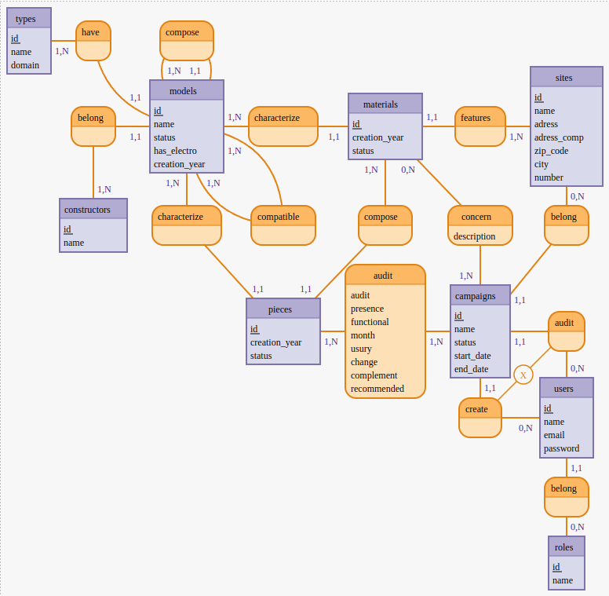
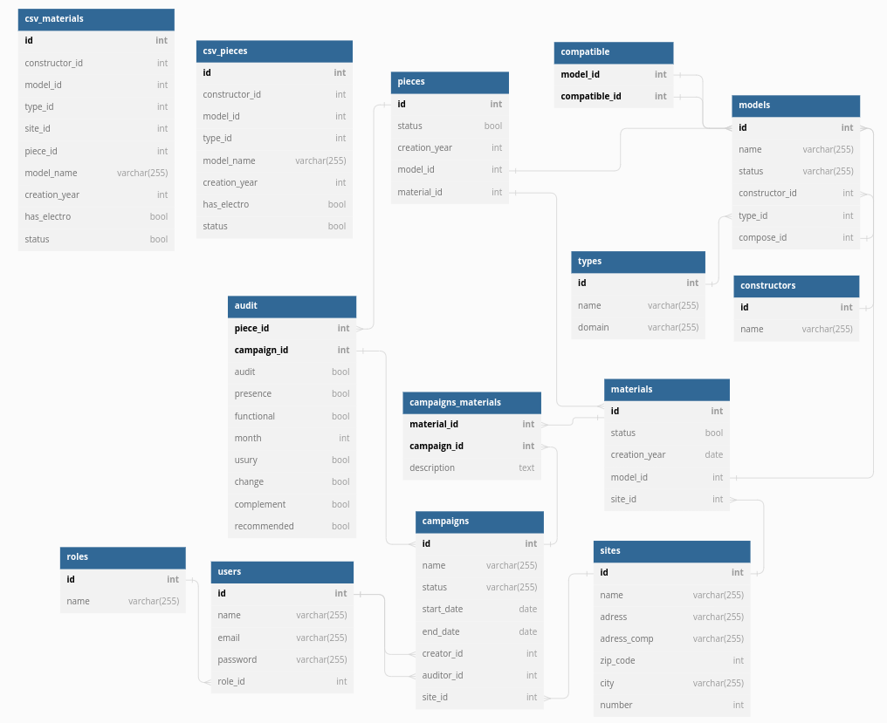

# ***1nspect0r***

**Table of contents :**
- [Team](#team)
- [MERISE :](#merise)
    - MCD
    - MLD

---
## **Team**

- [Florian Girault](https://gitlab.com/FLO-G)
- [Florian Manzone](https://gitlab.com/manzoneflorianpro)
- [Lisa Chalabi](https://gitlab.com/lisamina)

---
## **MERISE**

### *MCD :*
> Made with ***[MoCoDo](https://www.mocodo.net/)***

#### *Explication du MCD :*

  

**A voir: Gate & policies, spatie**

```
constructors: name
belong0, 1N constructors, 11 modeles
compatible, 1N modeles, 1N modeles
types: name, domain
:

:
characterize0, 11 pieces, 1N modeles
modeles: name, date_mm, status
have0, 1N types, 11 modeles
:

:
pieces: creation_year, has_electro, status
characterize1, 11 materials, 1N modeles
roles: name
have1, 0N roles, 11 users

:
constitute, 11 pieces, 1N materials
materials: creation_year, status
participate, 0N users, 11 campaigns
users: login, password

:
:
belong, 11 materials, 1N sites
campaigns: name, start_date, end_date, status
create, 0N users, 11 campaigns

:
:
sites: adress
audit, 1N sites, 11 campaigns
:
```




### *MLD :*
> Made with ***[DBDiagram](https://dbdiagram.io/d/)***

```
Table 1nspect0r.constructors {
  id int [pk, increment] 
  name varchar(100) unique
}

// types.domain qui determine si c'est un modele de piece ou de materiel
Table 1nspect0r.modeles {
  id int [pk]
  name varchar(100)
  date_mm date
  status bool
  constructor_id int
  type_id int
}

Ref: 1nspect0r.modeles.constructor_id < 1nspect0r.constructors.id
Ref: 1nspect0r.modeles.type_id < 1nspect0r.types.id

Table 1nspect0r.compatibles {
  modele_id int [pk]
  compatible_modele_id int [pk]
}

Ref: 1nspect0r.compatibles.modele_id > 1nspect0r.modeles.id
Ref: 1nspect0r.compatibles.compatible_modele_id > 1nspect0r.modeles.id

// domain = material ou piece
Table 1nspect0r.types {
  id int [pk]
  name varchar(100)
  domain varchar(30)
}

Table 1nspect0r.pieces {
  id int [pk]
  creation_year date 
  has_electro bool
  material_id int
  modele_id int
}

Ref: 1nspect0r.modeles.id < 1nspect0r.pieces.modele_id
Ref: 1nspect0r.materials.id < 1nspect0r.pieces.material_id

Table 1nspect0r.materials {
  id int [pk]
  creation_year date
  site_id int
  modele_id int
}

Ref: 1nspect0r.modeles.id < 1nspect0r.materials.modele_id
Ref: 1nspect0r.sites.id < 1nspect0r.materials.site_id

Table 1nspect0r.users {
  id int [pk]
  login varchar(50)
  password varchar(255)
  role_id int
}

Ref: 1nspect0r.roles.id < 1nspect0r.users.role_id

Table 1nspect0r.roles {
  id int [pk]
  name varchar(30)
}

Table 1nspect0r.campaigns {
  id int [pk]
  name varchar(150)
  start_date date
  end_date date
  status varchar(30)
  site_id int
  creator_id int
  participant_id int
}

Ref: 1nspect0r.sites.id < 1nspect0r.campaigns.site_id
Ref: 1nspect0r.users.id < 1nspect0r.campaigns.creator_id
Ref: 1nspect0r.users.id < 1nspect0r.campaigns.participant_id

Table 1nspect0r.sites {
  id int [pk]
  adress varchar(200)
}

```

